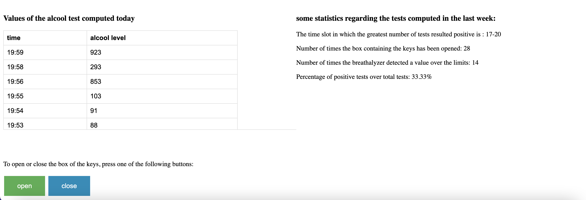

 # Alcool Test
This is the individual project for the IoT course 2022 of the master's degree "Engineering in computer science" at the "Sapienza" university.<br>
The project was born by observing that in most car-sharing services, people can drive the car even if they are drunk since there is no check on their conditions. Indeed to drive a car you need just to open it with the mobile application and take the keys inside. To solve the problem I created a cloud-based IoT breathalyzer connected to a box containing the keys of the car; if the test returns a negative value the box will open otherwise it will remain closed.

## Architecture of the system

### Sensors
The sensors used are the ultrasonic sensor and the MQ-3 alcohol sensor.

- #### Ultrasonic Sensor (HC SR04):
  It is used to allow the alcohol sensor to compute a correct measure. Indeed it is located near the MQ 3 sensor and only if the distance from the sensors to the person is smaller than 5 cm, the MQ 3 module will start to take measurements of the person’s blood-alcohol level when he breathes out. The distance is estimated by sending a trigger signal and receiving an echo signal; the time (in us) computed divided by 58 is the distance value in cm of the object in front of the ultrasonic sensor. It can measure distances in the range of 2-400 cm and the ranging accuracy can reach 3 mm. (the datasheet of the ultrasonic sensor can be found [here](https://cdn.sparkfun.com/datasheets/Sensors/Proximity/HCSR04.pdf)).
- #### MQ 3 sensor:
  It measures the concentration of alcohol in the air. Its detection range goes from 0.04 to 4 mg/l alcohol. It is a metal oxide semiconductor that detects the presence of alcohol vapors in the surroundings by changing resistance. Indeed when the concentration of alcohol becomes higher also the conductivity of the sensor rises. This change in conductivity is converted to an output value that indicates the level of the alcohol. In particular, when the value returned subtracted by 100 is greater than 450 the alcohol level is considered too high and the box key will remain closed. The sensor has both analog output and digital output, but for this project, the analog one is used. (the datasheet of the MQ 3 sensor can be found [here](https://www.pololu.com/file/0J310/MQ3.pdf)).


Since the alcohol test can be done at any moment by the user, periodic sensing is done by the ultrasonic sensor (every 5 seconds a new measurement is performed) as soon as the car is opened through the mobile app (by giving power to the system). When the box containing the keys has been opened, the sensor stops to take measures. When the keys are put again in the box and the last one is locked by pressing the button on it, the sensor will start sensing again. The MQ 3 sensor takes measurements only when the distance computed by the ultrasonic sensor is smaller than 5 cm, so a correct measurement can be computed.


### Actuators
The actuators used in the system are the servo motor, three LEDs (mini traffic light), a button, and a buzzer.
- #### Servo motor KY66:
  The servo motor is used to open or close the box containing the keys of the car. If the alcohol sensor returns a value smaller or equal to 450, the box will open so the keys can be taken. If the value measured is greater than 450 the box keys will remain closed. (the datasheet of the servo motor can be found [here](http://www.ee.ic.ac.uk/pcheung/teaching/DE1_EE/stores/sg90_datasheet.pdf)).
- #### Mini traffic light:
  It has three LEDs: red, yellow, and green. They are used to provide feedback on the distance measured by the ultrasonic sensor. The red led is turned on when the distance is greater than 15 cm; the yellow one is turned on when the distance is between 5 cm and 15 cm; the green one is turned on when the distance is smaller than 5 cm. When the green led is on it means that the person is close enough to the sensors and can proceed to make the alcohol test, so the MQ 3 sensor is activated and can measure the alcohol level. (the datasheet of the mini traffic light can be found [here](https://cdn.shopify.com/s/files/1/1509/1638/files/LED_Ampel_Modul_Datenblatt_AZ-Delivery_Vertriebs_GmbH.pdf?v=1607630369)).
- #### Button:
  It is used to close the box keys. When it is pressed the servo motor is activated and the box keys will close. (the datasheet of the button can be found [here](https://www.arduino.cc/documents/datasheets/Button.pdf)).
- #### Buzzer:
  It is used to provide feedback when the breathalyzer returns a value over the limits. When the MQ 3 sensor measures a value greater than 450, the buzzer is turned on for 1 second. (the datasheet of the buzzer can be found [here](https://www.farnell.com/datasheets/2171929.pdf)).

### Overall system


In the above image, there is a schema of the components that make up the system both at the IoT device level and at the cloud level. The sensors and the actuators are connected to an SMT NUCLEO-f401re board and the overall IoT device is developed using RIOT-OS. The cloud level is developed entirely using the AWS ecosystem.<br><br>

The IoT device level and the cloud one exchange messages through a communication protocol based on a publish/subscribe mechanism. The board sends the measures taken by the alcohol sensor to the Mosquitto broker using the MQTT-SN protocol. The messages are published under the topic “alcool_level”. Moreover, the board is subscribed to the topic “topic_in” to receive the messages sent from outside, that are used to close or open the box containing the keys. Mosquitto exchanges messages using MQTT with the AWS ecosystem through a transparent bridge, a python script that works as a bridge between Mosquitto and AWS IoT Core. Indeed it publishes the messages of “alcool_level” from the board to IoT Core and takes as input messages published from IoT Core under the topic “topic_in”, which are directed to the board.<br>

The messages coming from the board to IoT Core are then stored directly to the DynamoDB by setting a proper rule. They are then displayed on the web dashboard through a call of the REST API, which triggers the lambda function (“get_data_from_db.py”) that gets the data from the database. From the web dashboard, it is possible to close or open the box keys by publishing the message "close" or the message "open" under the topic “topic_in”. The messages are published to IoT Core by invoking the REST API which uses another lambda function (“publish_to_iotcore.py”) to perform this action.<br>

AWS Amplify is used to host all the static web content of the web dashboard.


## How the system work

The IoT device starts to take measures as soon as the power is given to the device (in this case when the car is opened by the mobile app). Since the MQ-3 sensor quantifies the alcohol level in the air, it will sense only when the distance of the person to the ultrasonic sensor is less than 5 cm; in this way, the MQ-3 sensor can return a correct measurement of the actual alcohol in the breath of the user when he/she blows on the device.  Feedback on the distance returned by the ultrasonic sensor is given by the mini traffic light:
- when the ultrasonic sensor measures a distance smaller than 5 cm, the green led is turned on and the user can proceed for the alcohol test by blowing on the MQ-3 sensor;
- when the distance measured is between 5 cm and 15 cm, the yellow led is turned on meaning that the distance to compute the test is almost good but the user must be more closed;
- when the distance measured is greater than 15 cm, the red led is turned on meaning that the distance is too far and the user must be more close to the sensors to take the alcohol test.

When the MQ-3 sensor computes the measurement, if the alcohol level is greater than 450 the box keys will remain closed and the buzzer is activated for 1 second; if the level is smaller than 450 the box keys will open and the sensors will stop sensing. In any case, the value measured by the MQ-3 sensor is displayed on the web dashboard. From the last one, it is also possible to close or open the box directly. When it's closed by the user when pressing the button or even from the web app the sensors will start again to take measurements.<br>

On the web dashboard there are :
- Two charts for displaying: the number of times the box keys has been open in the last seven days (values measured by the MQ-3 sensor smaller or equal to 450) and the number of times the alcohol test has returned a positive value in the last seven days. 
- A table displaying all measures taken by the MQ-3 sensor in the current day.
- The two buttons used to open or close the box keys. 
- Some statistics regarding the tests computed in the last seven days: the time slot in which the greatest number of tests resulted positive (a value between 8-12, 12-17, 17-20, 20-24 and 00-8); the number of times the box containing the keys has been opened; the number of time the breathalyzer detected a value over the limits; the percentage of positive tests over the total tests.

Two images of the web dashboard are attached below.


 

## Network performance


To measure the latency from the web dashboard to the IoT device and vice versa I used the prototype built. The latency measured to send the value of the alcohol test taken by the MQ-3 sensor to the web dashboard (and so to display the value in the charts) was smaller than 2 seconds, which of course is good for the system. The latency measured from when a button (close or open it doesn’t matter) is clicked to when the box is opened or closed was circa 1 second, which is acceptable for the system.<br>

The volume of data transmitted over the network is less than 10 bytes.  The value published under the topic “alcool_level” is 3 bytes and the value published under the topic “topic_in” is 5 bytes. In particular, to transmit data from the board to mosquitto, it was chosen MQTT-SN because of its peculiarities: it reduces the size of the message payload and removes the need for a permanent connection by using UDP as the transport protocol. 


## Walkthrough

These are all the steps you need to do to run and enjoy the system.
- ### Cloud level
  - DynamoDB:<br>
  create a table with the name “alcooltest”, insert “ts” in the box “partition key” and select “Number” from the drop-down menu near the box.
 
  - IoT Core:<br>
    
    to set up a new thing click on the button “connect device” on the [main page of AWS IoT](https://us-east-1.console.aws.amazon.com/iot/home?region=us-  east-1#/home). Use “alcooltest” as the name of the thing and follow the instructions to configure the setting. At the end of the configuration, you should see the same files of the image on the right inside the folder where the zip file was unzipped.<br><br> Now go to Secure -> Policies -> alcooltest-Policy and click on “edit active version”. Append “,arn:aws:iot:us-east-1:756981985227:topic/topic_in,arn:aws:iot:us-east-1:756981985227:topic/alcool_level” at the end of the first box “Policy resource”, and append “,arn:aws:iot:us-east-1:756981985227:topicfilter/topic_in,arn:aws:iot:us-east-1:756981985227:topicfilter/alcool_level” at the end of the second box. Then select “set the edit version as the active version for this policy” and click on “save as new version”.<br><br> Then go to Act -> Rules and click on the “create” button. Set “alcooltest_rule” as the name of the rule, replace the text in “Rule query statement” with “SELECT message FROM ‘alcool_level’” and click on the button “add action”. Select “insert a message into a Dynamo table” and click on “configure action”. Select from the drop-down list of “table name” the table “alcool_test”. Check if “partition key” is “ts”, if “partition key type” is “NUMBER” and insert “${timestamp()}” in “partition key value”. Then write “level” in the box “write message data to this column”, create a role user, and click on “add action”. Then click on “create rule”.
  
  - Lambda:<br>
  create 2 lambda functions by clicking on the button “create function”. For both of them select “python 3.8” from the drop-down menu of “Runtime”. Give the name “get_data_from_db” to one function and the name “publish_topicin” to the other one. Then replace the code under “Code source” with the one available in the folder “Lambda” and save the changes. The last step is to configure the policies to get data from DynamoDB in the first case and to publish messages in IoT core in the second case. To set the policy click on the “Configuration” tab and select “Permissions” from the right side menu; in the “Execution role” box click on the role (a new browser tab will open), then click on the drop-down menu “Add permissions” on the right of the “permission policies” box and select “create inline policy”. Click on the “JSON” tab and replace the following code in the text area:
    - for the “get_data_from_db” function use the following code, taking care to replace the ARN of the table created previously in the “Resource” field on line 15:<br>
      ```JSON
      {
      "Version": "2012-10-17",
      "Statement": [
          {
              "Sid": "VisualEditor0",
              "Effect": "Allow",
              "Action": [
                  "dynamodb:PutItem",
                  "dynamodb:DeleteItem",
                  "dynamodb:GetItem",
                  "dynamodb:Scan",
                  "dynamodb:Query",
                  "dynamodb:UpdateItem"
              ],
              "Resource": "YOUR-TABLE-ARN"
          }
          ]
      }
      ```
    - for the “publish_topicin” function use the following code:
      ```JSON
      {
          "Version": "2012-10-17",
          "Statement": [
              {
                  "Sid": "VisualEditor0",
                  "Effect": "Allow",
                  "Action": "iot:Publish",
                  "Resource": "*"
              }
          ]
      }
      ```
  - API Gateway:<br>
  click on the button “Create API” and select the option “REST API”. In the “API name” field type “alcooltestAPI” and select “Edge optimized” in the “Endpoint Type” drop-down. Once the API is created, in the left nav select “Resources'' and with the “/” resource selected click “Create Method” from the "Action" drop-down menu. Select POST from the new drop-down menu and then click on the checkmark; select “lambda function” for the “integration type” and type “get_data_from_db” into the “Lambda Function” field. With the newly created POST method selected, select “Enable CORS” from the “Action” drop-down menu. Then in the "Actions" drop-down list select "Deploy API"; select "[New Stage]" in the "Deployment stage" drop-down list, enter “dev” for the "Stage Name" and click on “Deploy”. Copy and save the URL next to "Invoke URL" (you will need it later). Repeat all these steps also to create a GET resource linked to the lambda function “publish_topicin”.
  
  - AWS Amplify:<br>
  first, edit the code in the file WebbApp/index.js: in the functions “publish_topic_to_iotcore” and “callAPI” change the argument of the “fetch” function with the URL copied in the last step. Then create a new app. Click “get started” under “Host your web app”, select “Deploy without Git Provider” and click on “continue”. In the “App name” field type “AlcoolTest”, for the “Environment” name type “dev” and select the option “Drag and Drop”. Then compress the code provided in the WebApp folder and upload it. Now you can open the web dashboard from the link provided by AWS Amplify.
  
  
- ### IoT device level
  - First of all, you need to clone this repository to your machine.

  - Clone the [repository](https://github.com/eclipse/mosquitto.rsmb) of mosquitto.rsmb and follow the guide in the link to set up the system correctly. Then go to the folder mosquitto.rsmb/rsmb/src and run the command:

    ```
    ./broker_mqtts config.conf
    ```
  - copy the file “transparent_bridge.py” provided in this repository inside the folder created during the IoT core setup (the “aws” folder in the previous image). Then run the following command inside this folder:

    ```
    python3 transparent_bridge.py
    ```
  - Connect all the sensors and actuators to the board using the following schema. It was used a resistor of 1 Ohm for the buzzer and a resistor of 10K Ohm for the button.<br>
    
  

  - Clone the [RIOT repository](https://github.com/RIOT-OS/RIOT) under the “Riot Code” folder of this repository. Connect the board to the machine and run the following commands:

    ```
    cd
    sudo ./RIOT/dist/tools/tapsetup/tapsetup
    sudo ip a a fec0:affe::1/64 dev tapbr0
    ```
    then go inside the “Riot Code” folder and run the command:

    ```
    make flash term
    ```

## Gallery
 


## Useful links

This is my [LinkedIn account](https://www.linkedin.com/in/alessandro-marzilli-84a07a235/).<br>

[Here](https://www.hackster.io/alessandro-marzilli/alcohol-test-b53117) there is a blog post related to this project.<br>

[Here]() there is a youtube video to show how the system works.<br>

[Here](https://dev.d3dtkbjgsjedi9.amplifyapp.com) there is the link to the web dashboard.<br>

